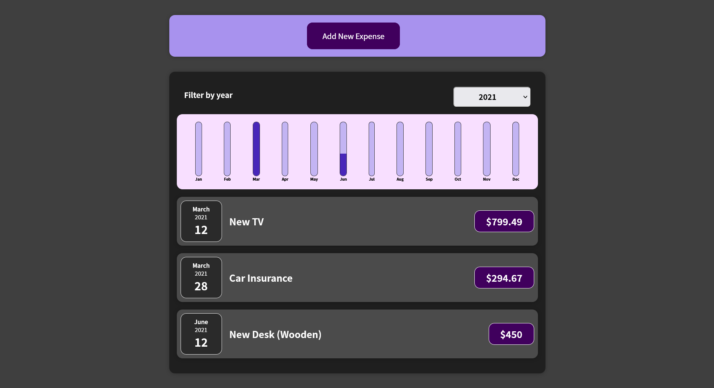
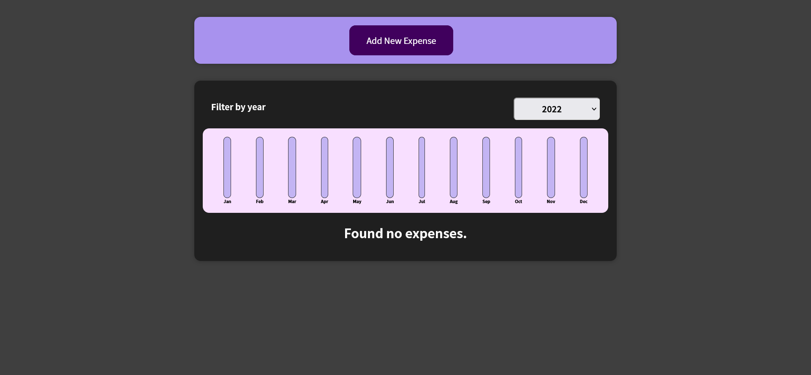
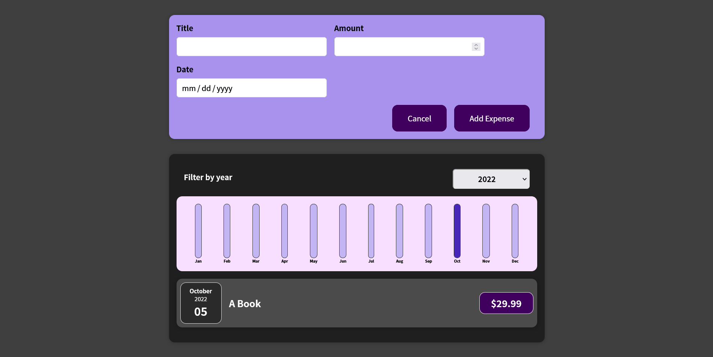

## About The Project





Expenses tracker is a React application. This app created while following a React Udemy Course by Maximilian Schwarzmüller 

### Built With

This app is built with React.js along with HTML and CSS. It uses NPM as package manager.

- [React](https://reactjs.org/)
- [JavaScript](https://developer.mozilla.org/en-US/docs/Web/javascript)
- [HTML](https://developer.mozilla.org/en-US/docs/Web/HTML)
- [CSS](https://developer.mozilla.org/en-US/docs/Web/css)
- [NPM](https://www.npmjs.com/)

### Installation

1. Clone the repo
   ```sh
   git clone https://github.com/AbdallahRaslan/ExpensesTracker.git
   ```
2. Install NPM packages
   ```sh
   npm install
   ```

3. Run Start 
  ```sh
   npm install
   ```
